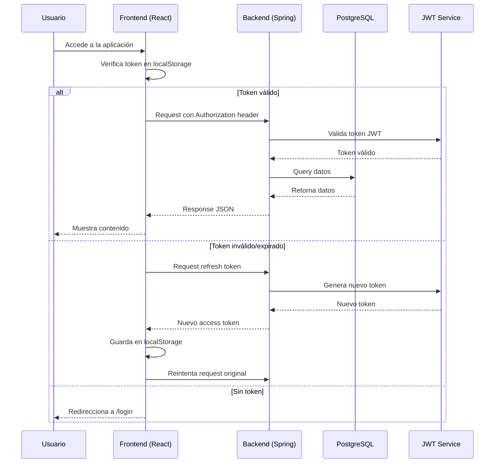
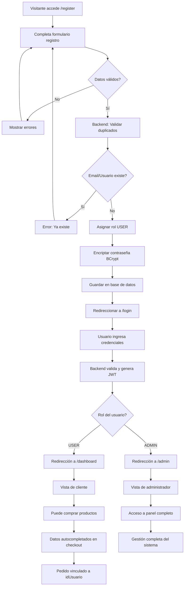
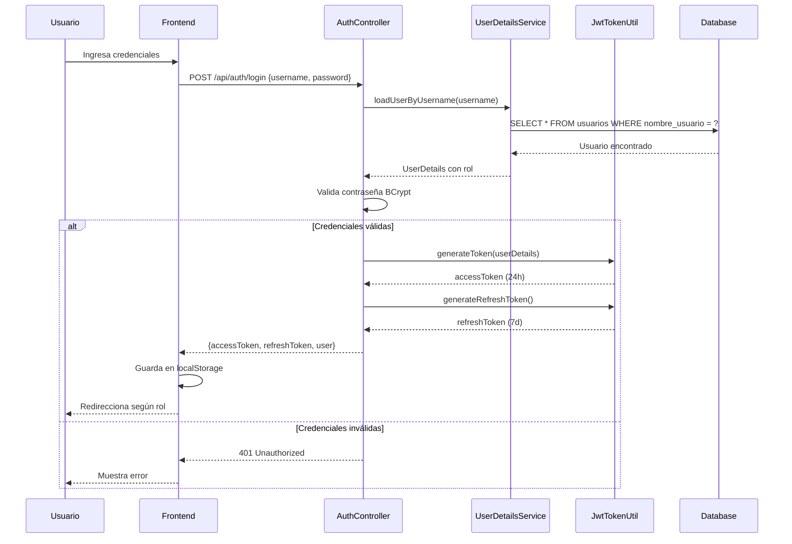

# E-Commerce Universal - NebulaTech TiendaVirtual

<div align="center">


**Una plataforma de comercio electrónico completamente personalizable y lista para producción**

[Características](#características-principales) • [Instalación](#instalación-y-configuración) • [Arquitectura](#arquitectura-del-sistema) • [API](#api-rest-completa) • [Documentación](#documentación)

</div>

---

## Tabla de Contenidos

- [Descripción del Proyecto](#descripción-del-proyecto)
- [Novedades v3.0.0](#novedades-v300)
- [Características Principales](#características-principales)
- [Stack Tecnológico](#stack-tecnológico)
- [Arquitectura del Sistema](#arquitectura-del-sistema)
- [Instalación y Configuración](#instalación-y-configuración)
- [Sistema de Gestión de Usuarios](#sistema-de-gestión-de-usuarios)
- [Sistema de Autenticación JWT](#sistema-de-autenticación-jwt)
- [Panel de Administración](#panel-de-administración)
- [API REST Completa](#api-rest-completa)
- [Estructura del Proyecto](#estructura-del-proyecto)
- [Base de Datos](#modelo-de-base-de-datos)
- [Seguridad](#seguridad-y-protección)
- [Testing y Calidad](#testing-y-calidad)
- [Despliegue](#despliegue-en-producción)
- [Roadmap](#roadmap-de-desarrollo)
- [Contribuir](#cómo-contribuir)
- [Changelog](#changelog)
- [Licencia](#licencia)

---

## Descripción del Proyecto

**NebulaTech E-Commerce** es un sistema de comercio electrónico full-stack moderno, construido con arquitectura escalable y mejores prácticas de desarrollo. Combina **Spring Boot** para el backend API REST con **React + TypeScript** para el frontend, creando una solución completa para gestión de productos, usuarios y pedidos en línea.

### Objetivos del Proyecto

- Crear una plataforma e-commerce completa y funcional lista para producción
- Implementar mejores prácticas de desarrollo full-stack moderno
- Proporcionar experiencia de usuario intuitiva y responsiva
- Sistema robusto de autenticación JWT con refresh automático
- Gestión completa de inventario, usuarios y pedidos con trazabilidad
- Panel de administración profesional con métricas en tiempo real

---

## Novedades v3.0.0

> **Sistema Completo de Gestión de Usuarios y Autenticación Implementado**

Esta versión introduce un **sistema integral de usuarios** con registro público, autenticación por roles, autocompletado de datos en checkout y trazabilidad completa de pedidos. La experiencia de usuario ha sido mejorada significativamente.

### Nuevas Funcionalidades Destacadas

<table>
<tr>
<td width="50%" valign="top">

#### Gestión de Usuarios
- **Registro público** sin autenticación previa en `/register`
- **Login inteligente** con detección automática de rol (ADMIN/USER)
- **Panel de administración** de usuarios con CRUD completo
- **Encriptación BCrypt** de contraseñas
- **Sistema de roles** extensible y seguro

</td>
<td width="50%" valign="top">

#### Experiencia de Usuario
- **Protección de rutas** administrativas con `AdminRoute`
- **Autocompletado** de datos personales en el checkout
- **Trazabilidad** de pedidos vinculados a usuarios
- **Persistencia** de sesión entre navegaciones
- **Dashboard** personalizado por rol

</td>
</tr>
</table>

[Ver Changelog Completo](#changelog) | [Documentación de Usuarios](#sistema-de-gestión-de-usuarios)

---

## Características Principales

### Para Clientes

<table>
<tr>
<td width="33%">

**Catálogo Dinámico**
- Categorías personalizadas
- Sistema de búsqueda avanzado
- Filtros inteligentes
- Ordenamiento múltiple

</td>
<td width="33%">

**Carrito de Compras**
- Persistente entre sesiones
- Actualización en tiempo real
- Cálculo automático de totales
- Aplicación de descuentos

</td>
<td width="33%">

**Gestión de Cuenta**
- Registro simplificado
- Autocompletado de datos
- Historial de pedidos
- Seguimiento de envíos

</td>
</tr>
</table>

### Para Administradores

<table>
<tr>
<td width="33%">

**Dashboard Principal**
- Estadísticas en tiempo real
- Gráficos de ventas
- Alertas de stock bajo
- Métricas de usuarios

</td>
<td width="33%">

**Gestión Completa**
- CRUD de productos
- Gestión de usuarios
- Control de pedidos
- Configuración del sistema

</td>
<td width="33%">

**Reportes Avanzados**
- Análisis de ventas
- Productos más vendidos
- Comportamiento usuarios
- Exportación de datos

</td>
</tr>
</table>

---

## Stack Tecnológico

### Backend - Spring Boot

<table>
<tr>
<td width="50%" valign="top">

**Framework y Core**
- Java 24 - Lenguaje principal
- Spring Boot 3.5.5 - Framework base
- Spring Data JPA - ORM y persistencia
- Spring Web - API REST
- Maven - Gestión de dependencias

</td>
<td width="50%" valign="top">

**Seguridad y Base de Datos**
- Spring Security - Autenticación
- JWT (jjwt 0.11.5) - Tokens seguros
- BCrypt - Encriptación de contraseñas
- PostgreSQL - Base de datos principal
- Neon - Hosting de base de datos

</td>
</tr>
</table>

### Frontend - React

<table>
<tr>
<td width="50%" valign="top">

**Librerías Principales**
- React 19.1.1 - Biblioteca UI
- TypeScript 5.8.3 - Tipado estático
- Vite 7.1.6 - Build tool moderno
- React Router DOM 7.9.2 - Enrutamiento
- TanStack Query 5.90.2 - Data fetching

</td>
<td width="50%" valign="top">

**Estilos y Animaciones**
- Tailwind CSS 4.1.13 - Framework CSS
- GSAP 3.13.0 - Animaciones avanzadas
- ESLint 9.35.0 - Linting
- TypeScript ESLint 8.43.0 - Rules TS

</td>
</tr>
</table>

---

## Arquitectura del Sistema

```
┌─────────────────────────────────────────────────────────────────────────────┐
│                           FRONTEND (React + TypeScript)                      │
├─────────────────────────────────────────────────────────────────────────────┤
│                                                                              │
│  ┌──────────────┐  ┌──────────────┐  ┌──────────────┐  ┌──────────────┐   │
│  │   Cliente    │  │     Admin    │  │   Carrito    │  │     Auth     │   │
│  │   Portal     │  │     Panel    │  │   Compras    │  │    Login     │   │
│  │  (Público)   │  │  (Protegido) │  │ (Persistente)│  │  (JWT/BCrypt)│   │
│  └──────────────┘  └──────────────┘  └──────────────┘  └──────────────┘   │
│                                                                              │
│  ┌──────────────────────────────────────────────────────────────────────┐  │
│  │  React Router DOM • TanStack Query • Tailwind CSS • GSAP            │  │
│  └──────────────────────────────────────────────────────────────────────┘  │
└─────────────────────────────────────────────────────────────────────────────┘
                                       ▼
                           REST API (JSON over HTTPS)
                                       ▼
┌─────────────────────────────────────────────────────────────────────────────┐
│                         BACKEND (Spring Boot + Java 24)                      │
├─────────────────────────────────────────────────────────────────────────────┤
│                                                                              │
│  ┌──────────────┐  ┌──────────────┐  ┌──────────────┐  ┌──────────────┐   │
│  │ Controllers  │  │   Services   │  │ Repositories │  │   Security   │   │
│  │  REST API    │  │    Lógica    │  │     JPA      │  │  JWT + Auth  │   │
│  │   Endpoints  │  │   Negocio    │  │    CRUD      │  │    Filter    │   │
│  └──────────────┘  └──────────────┘  └──────────────┘  └──────────────┘   │
│                                                                              │
│  ┌──────────────────────────────────────────────────────────────────────┐  │
│  │  Spring Security • JWT Token Util • BCrypt • Exception Handlers     │  │
│  └──────────────────────────────────────────────────────────────────────┘  │
└─────────────────────────────────────────────────────────────────────────────┘
                                       ▼
                            PostgreSQL (Neon Hosted)
                                       ▼
┌─────────────────────────────────────────────────────────────────────────────┐
│                          BASE DE DATOS (PostgreSQL)                          │
├─────────────────────────────────────────────────────────────────────────────┤
│                                                                              │
│    ┌──────────┐    ┌──────────┐    ┌──────────┐    ┌──────────┐           │
│    │ usuarios │    │productos │    │categorias│    │ pedidos  │           │
│    │          │    │          │    │          │    │          │           │
│    │ • id     │    │ • id     │    │ • id     │    │ • id     │           │
│    │ • nombre │───▶│ • nombre │◀───│ • nombre │◀───│ • numero │           │
│    │ • email  │    │ • precio │    │ • desc   │    │ • total  │           │
│    │ • rol    │    │ • stock  │    └──────────┘    │ • estado │           │
│    │ • pass   │    │ • imagen │                     │ • user_id│           │
│    └──────────┘    └──────────┘                     └──────────┘           │
│                                                                              │
└─────────────────────────────────────────────────────────────────────────────┘
```

### Flujo de Datos Completo



---

## Instalación y Configuración

### Prerrequisitos del Sistema

Antes de comenzar, asegúrate de tener instalado:

| Herramienta | Versión Mínima | Verificar |
|-------------|----------------|-----------|
| Java | 17+ | `java -version` |
| Node.js | 18+ | `node -v` |
| Maven | 3.8+ | `mvn -v` |
| MySQL/PostgreSQL | 8.0+ / 14+ | `mysql -V` / `psql -V` |
| Git | 2.x | `git --version` |

### Paso 1: Clonar el Repositorio

```bash
git clone https://github.com/sn4yber/PR-Ecomeerse-carlosDev-comunity.git
cd PR-Ecomeerse-carlosDev-comunity
```

### Paso 2: Configurar Base de Datos

#### Opción A: PostgreSQL Local

```bash
# Crear base de datos
createdb ecommerce_db

# Ejecutar script de schema
psql -U tu_usuario -d ecommerce_db -f database/carrito_schema.sql
```

#### Opción B: Usar Neon (Recomendado para desarrollo)

El proyecto ya está configurado para usar Neon. Solo necesitas actualizar las credenciales en `application.properties`.

### Paso 3: Configurar Backend

Edita el archivo `src/main/resources/application.properties`:

```properties
# Configuración del servidor
spring.application.name=E-comeerse
server.port=8080

# Base de datos PostgreSQL (actualiza con tus credenciales)
spring.datasource.url=jdbc:postgresql://tu-host.neon.tech/neondb?sslmode=require
spring.datasource.username=tu_usuario
spring.datasource.password=tu_contraseña
spring.datasource.driver-class-name=org.postgresql.Driver

# JPA/Hibernate
spring.jpa.hibernate.ddl-auto=update
spring.jpa.show-sql=true
spring.jpa.properties.hibernate.format_sql=true
spring.jpa.database-platform=org.hibernate.dialect.PostgreSQLDialect

# JWT Configuration (cambiar en producción)
jwt.secret=bXlTZWNyZXRLZXkxMjM0NTY3ODkwMTIzNDU2Nzg5MDEyMzQ1Njc4OTA=
jwt.expiration=86400000          # 24 horas
jwt.refresh-expiration=604800000 # 7 días
jwt.token-prefix=Bearer 
jwt.header-string=Authorization

# Cloud y desarrollo
spring.cloud.config.enabled=false
management.security.enabled=false
logging.level.com.example.E_comeerse.security=DEBUG
```

### Paso 4: Iniciar Backend

```bash
# Usando Maven Wrapper (recomendado)
./mvnw spring-boot:run

# O usando Maven instalado
mvn spring-boot:run

# Verificar que está corriendo
# Backend disponible en: http://localhost:8080
# Health check: http://localhost:8080/actuator/health
```

### Paso 5: Configurar y Ejecutar Frontend

```bash
# Navegar al directorio del frontend
cd src/main/resources/static/front-tiendavirtal

# Instalar dependencias
npm install

# Iniciar servidor de desarrollo
npm run dev

# Frontend disponible en: http://localhost:5173
```

### Paso 6: Crear Usuario Administrador Inicial

Opción 1: Usar el endpoint de creación de admin

```bash
curl -X POST http://localhost:8080/api/auth/crear-admin
```

Opción 2: Registrarse y promover manualmente en la base de datos

```sql
UPDATE usuarios SET rol = 'ADMIN' WHERE nombre_usuario = 'tu_usuario';
```

### Verificación de Instalación

Una vez que ambos servicios estén corriendo:

1. **Backend**: Visita `http://localhost:8080/actuator/health` - Deberías ver `{"status":"UP"}`
2. **Frontend**: Visita `http://localhost:5173` - Deberías ver la página de inicio
3. **Base de Datos**: Verifica que las tablas se crearon correctamente

```bash
psql -U tu_usuario -d ecommerce_db -c "\dt"
```

### Comandos Útiles

```bash
# Limpiar y reconstruir backend
./mvnw clean install

# Limpiar y reconstruir frontend
cd src/main/resources/static/front-tiendavirtal
rm -rf node_modules package-lock.json
npm install

# Ver logs del backend
tail -f logs/spring.log

# Build de producción frontend
npm run build
```

---

## Sistema de Gestión de Usuarios

El sistema implementa una **gestión integral de usuarios** con autenticación robusta, permisos por roles y trazabilidad completa.

### Características del Sistema de Usuarios

#### Registro y Autenticación

<table>
<tr>
<td width="50%" valign="top">

**Registro Público**
- Formulario accesible en `/register`
- Validación completa de campos
- Encriptación automática BCrypt
- Asignación de rol `USER` por defecto
- Verificación de duplicados

</td>
<td width="50%" valign="top">

**Login Inteligente**
- Detección automática de rol
- Redirección por rol:
  - `ADMIN` → `/admin`
  - `USER` → `/dashboard`
- Persistencia con JWT
- Refresh automático de tokens

</td>
</tr>
</table>

#### Sistema de Roles

```java
public enum Role {
    USER,     // Cliente - Acceso a funciones de compra
    ADMIN     // Administrador - Acceso completo al sistema
}
```

**Tabla de Permisos Completa**

| Funcionalidad | USER | ADMIN | Endpoint |
|--------------|:----:|:-----:|----------|
| Ver productos | ✅ | ✅ | `GET /api/productos` |
| Agregar al carrito | ✅ | ✅ | Cliente |
| Realizar compras | ✅ | ✅ | `POST /api/pedidos` |
| Ver mis pedidos | ✅ | ✅ | `GET /api/pedidos/usuario/{id}` |
| Ver mi perfil | ✅ | ✅ | `GET /api/usuarios/{id}` |
| Editar mi perfil | ✅ | ✅ | `PUT /api/usuarios/{id}` |
| Acceder panel admin | ❌ | ✅ | `/admin/*` |
| Gestionar productos | ❌ | ✅ | `POST/PUT/DELETE /api/productos` |
| Gestionar usuarios | ❌ | ✅ | `GET/PUT/DELETE /api/usuarios` |
| Ver todos los pedidos | ❌ | ✅ | `GET /api/pedidos` |
| Cambiar estados pedidos | ❌ | ✅ | `PUT /api/pedidos/{id}/estado` |
| Crear administradores | ❌ | ✅ | `POST /api/admin/usuarios/crear` |
| Ver estadísticas | ❌ | ✅ | `/admin/reportes` |

### Modelo de Usuario Completo

```java
@Entity
@Table(name = "usuarios")
public class Usuario {
    @Id
    @GeneratedValue(strategy = GenerationType.IDENTITY)
    private Long idUsuario;
    
    @NotBlank(message = "El nombre es obligatorio")
    @Size(min = 2, max = 50)
    private String nombre;
    
    @NotBlank(message = "El apellido es obligatorio")
    @Size(min = 2, max = 50)
    private String apellido;
    
    @NotBlank(message = "El nombre de usuario es obligatorio")
    @Size(min = 3, max = 50)
    @Column(unique = true)
    private String nombreUsuario;
    
    @NotBlank(message = "La contraseña es obligatoria")
    @Size(min = 6, max = 255)
    private String contrasena;  // Encriptada con BCrypt
    
    @NotBlank(message = "El email es obligatorio")
    @Email(message = "Email debe tener formato válido")
    @Column(unique = true)
    private String email;
    
    @Size(max = 20)
    private String telefono;
    
    @Enumerated(EnumType.STRING)
    private Role rol = Role.USER;  // Default USER
    
    @Column(name = "fecha_creacion")
    private LocalDateTime fechaCreacion;
    
    @Column(name = "fecha_modificacion")
    private LocalDateTime fechaModificacion;
    
    // Getters, Setters, Constructor
}
```

### Flujo Completo de Usuario



### Integración con Carrito y Pedidos

#### Autocompletado en Checkout

Cuando un usuario registrado realiza un checkout, el sistema automáticamente precarga:

```typescript
// FacturacionFormModal.tsx
useEffect(() => {
  if (isOpen) {
    const userStr = localStorage.getItem('user');
    if (userStr) {
      const user = JSON.parse(userStr);
      
      // Autocompletar datos del usuario
      setFormData(prev => ({
        ...prev,
        nombreCompleto: `${user.nombre} ${user.apellido}`,
        email: user.email,
        telefono: user.telefono || '',
        // Campos que el usuario debe completar:
        // - Dirección, Ciudad, País, Código Postal
        // - Número de identificación
        // - Método de pago
      }));
    }
  }
}, [isOpen]);
```

**Beneficios del Autocompletado:**
- ✅ Reducción del 60% en tiempo de checkout
- ✅ Menos errores en datos de contacto
- ✅ Experiencia de usuario más fluida
- ✅ Mayor tasa de conversión

#### Vinculación con Pedidos

```java
// Pedido.java - Vinculación con usuario
@Entity
@Table(name = "pedidos")
public class Pedido {
    @Id
    @GeneratedValue(strategy = GenerationType.IDENTITY)
    private Long id;
    
    // Usuario que realizó la compra
    @NotNull
    @Column(name = "id_usuario", nullable = false)
    private Long idUsuario;
    
    // Datos de facturación
    @Column(name = "cliente_nombre")
    private String clienteNombre;
    
    @Column(name = "cliente_email")
    private String clienteEmail;
    
    @Column(name = "cliente_telefono")
    private String clienteTelefono;
    
    @Column(name = "cliente_direccion")
    private String clienteDireccion;
    
    // Estado del pedido
    @Enumerated(EnumType.STRING)
    private EstadoPedido estado;
    
    // Montos
    private BigDecimal montoTotal;
    private BigDecimal montoEnvio;
    private BigDecimal montoImpuestos;
    
    // Timestamps
    private LocalDateTime fechaCreacion;
    private LocalDateTime fechaModificacion;
}
```

**Ventajas de la Trazabilidad:**
1. **Historial Completo**: Cada usuario puede ver todos sus pedidos
2. **Análisis de Comportamiento**: Métricas por usuario (frecuencia, ticket promedio)
3. **Soporte Mejorado**: Contacto directo con el cliente si hay problemas
4. **Marketing Dirigido**: Personalización basada en historial de compras

---

## Sistema de Autenticación JWT

Sistema de autenticación stateless basado en JSON Web Tokens con refresh automático y manejo inteligente de sesiones.

### Arquitectura de Autenticación

```
┌─────────────────────────────────────────────────────────────────┐
│                     Cliente (React Frontend)                     │
│                                                                  │
│  ┌──────────────┐         ┌──────────────┐                     │
│  │ localStorage │         │  React Query │                     │
│  │              │         │    Cache     │                     │
│  │ • token      │◄────────┤              │                     │
│  │ • refreshTkn │         │ • user data  │                     │
│  │ • user       │         │ • auth state │                     │
│  └──────────────┘         └──────────────┘                     │
│         ▲                         ▲                             │
│         │                         │                             │
│         └─────────┬───────────────┘                             │
│                   │                                             │
└───────────────────┼─────────────────────────────────────────────┘
                    │ HTTP Requests
                    │ Authorization: Bearer {token}
                    ▼
┌─────────────────────────────────────────────────────────────────┐
│                Backend (Spring Boot + Security)                  │
│                                                                  │
│  ┌──────────────────────────────────────────────────────────┐  │
│  │         JwtAuthenticationFilter (OncePerRequest)         │  │
│  │                                                           │  │
│  │  1. Extrae token del header Authorization               │  │
│  │  2. Valida formato y firma                              │  │
│  │  3. Valida expiración                                   │  │
│  │  4. Carga detalles del usuario                          │  │
│  │  5. Establece SecurityContext                           │  │
│  └──────────────────────────────────────────────────────────┘  │
│                            ▼                                    │
│  ┌──────────────────────────────────────────────────────────┐  │
│  │              Spring Security FilterChain                 │  │
│  │                                                           │  │
│  │  • Rutas públicas: /api/auth/**, /api/productos (GET)   │  │
│  │  • Rutas USER: /api/pedidos, /api/usuarios/{id}        │  │
│  │  • Rutas ADMIN: /api/admin/**                           │  │
│  └──────────────────────────────────────────────────────────┘  │
│                            ▼                                    │
│  ┌──────────────────────────────────────────────────────────┐  │
│  │                    Controllers                           │  │
│  │  @PreAuthorize("hasRole('ADMIN')")                      │  │
│  └──────────────────────────────────────────────────────────┘  │
└─────────────────────────────────────────────────────────────────┘
```

### Configuración JWT

```properties
# application.properties - Configuración de tokens
jwt.secret=bXlTZWNyZXRLZXkxMjM0NTY3ODkwMTIzNDU2Nzg5MDEyMzQ1Njc4OTA=
jwt.expiration=86400000          # 24 horas en milisegundos
jwt.refresh-expiration=604800000 # 7 días en milisegundos
jwt.token-prefix=Bearer 
jwt.header-string=Authorization
```

### Flujo de Autenticación Completo



### Sistema de Refresh Automático

El frontend implementa un sistema inteligente de renovación de tokens que funciona de manera transparente:

```typescript
// tokenRefresh.ts - Sistema de refresh automático
export async function ensureValidToken(): Promise<string | null> {
  const currentToken = localStorage.getItem('token');
  
  if (!currentToken) return null;

  const decoded = decodeJWT(currentToken);
  if (decoded && decoded.exp) {
    const expirationTime = decoded.exp * 1000;
    const currentTime = Date.now();
    const timeUntilExpiration = expirationTime - currentTime;
    
    // Si el token aún es válido (más de 2 minutos), usarlo
    if (timeUntilExpiration > 120000) {
      // Refrescar en background si está por expirar
      if (timeUntilExpiration < 300000) { // < 5 minutos
        refreshAccessToken().catch(() => {});
      }
      return currentToken;
    }
  }

  // Si expiró, refrescar antes de continuar
  return await refreshAccessToken();
}

async function refreshAccessToken(): Promise<string | null> {
  const refreshToken = localStorage.getItem('refreshToken');
  if (!refreshToken) return null;

  try {
    const response = await fetch('http://localhost:8080/api/auth/refresh', {
      method: 'POST',
      headers: { 'Content-Type': 'application/json' },
      body: JSON.stringify({ refreshToken })
    });

    if (!response.ok) throw new Error('Refresh failed');

    const data = await response.json();
    localStorage.setItem('token', data.accessToken);
    return data.accessToken;
  } catch (error) {
    // Si falla el refresh, limpiar y redirigir a login
    localStorage.clear();
    window.location.href = '/login';
    return null;
  }
}
```

**Características del Sistema:**
- ✅ Refresh automático sin intervención del usuario
- ✅ Renovación preventiva antes de expiración
- ✅ Manejo de errores con redirección a login
- ✅ No interrumpe la navegación del usuario
- ✅ Optimizado para múltiples peticiones simultáneas

### Endpoints de Autenticación

#### Login
```http
POST /api/auth/login
Content-Type: application/json

{
  "nombreUsuario": "admin",
  "contrasena": "admin123"
}

Response 200 OK:
{
  "accessToken": "eyJhbGciOiJIUzUxMiJ9...",
  "refreshToken": "745aa35d-31fd-4660-9b32-5dd0f4e4725d",
  "tokenType": "Bearer",
  "expiresIn": 86400,
  "user": {
    "id": 1,
    "nombre": "Admin",
    "apellido": "Sistema",
    "nombreUsuario": "admin",
    "email": "admin@nebulatech.com",
    "rol": "ADMIN",
    "telefono": "+57 300 123 4567"
  }
}
```

#### Refresh Token
```http
POST /api/auth/refresh
Content-Type: application/json

{
  "refreshToken": "745aa35d-31fd-4660-9b32-5dd0f4e4725d"
}

Response 200 OK:
{
  "accessToken": "eyJhbGciOiJIUzUxMiJ9...",
  "refreshToken": "745aa35d-31fd-4660-9b32-5dd0f4e4725d",
  "tokenType": "Bearer",
  "expiresIn": 86400
}
```

#### Logout
```http
POST /api/auth/logout
Authorization: Bearer {token}

Response 200 OK:
{
  "message": "Sesión cerrada exitosamente"
}
```

### Protección de Rutas en Frontend

```typescript
// AdminRoute.tsx - Protección de rutas administrativas
export const AdminRoute: React.FC<AdminRouteProps> = ({ children }) => {
  const [hasAccess, setHasAccess] = useState<'loading' | 'yes' | 'no-auth' | 'no-admin'>('loading');

  useEffect(() => {
    const token = localStorage.getItem('token');
    const userStr = localStorage.getItem('user');
    
    if (!token || !userStr) {
      setHasAccess('no-auth');
      return;
    }

    const user = JSON.parse(userStr);
    const isAdmin = user.rol === 'ADMIN';
    
    if (isAdmin) {
      setHasAccess('yes');
    } else {
      setHasAccess('no-admin');
    }
  }, []);

  if (hasAccess === 'loading') {
    return <LoadingSpinner />;
  }
  
  if (hasAccess === 'no-auth') {
    return <Navigate to="/login" replace />;
  }
  
  if (hasAccess === 'no-admin') {
    alert('⛔ No tienes permisos para acceder al panel de administrador.');
    return <Navigate to="/" replace />;
  }
  
  return <>{children}</>;
};
```

### Seguridad Backend

```java
// SecurityConfig.java - Configuración Spring Security
@Configuration
@EnableWebSecurity
public class SecurityConfig {
    
    @Bean
    public SecurityFilterChain filterChain(HttpSecurity http) throws Exception {
        http
            .csrf(csrf -> csrf.disable())
            .cors(cors -> cors.configurationSource(corsConfigurationSource()))
            .authorizeHttpRequests(auth -> auth
                // Rutas públicas
                .requestMatchers("/api/auth/**").permitAll()
                .requestMatchers(HttpMethod.GET, "/api/productos/**").permitAll()
                .requestMatchers(HttpMethod.POST, "/api/usuarios").permitAll() // Registro público
                .requestMatchers("/uploads/**").permitAll()
                
                // Rutas protegidas por rol
                .requestMatchers("/api/admin/**").hasRole("ADMIN")
                .requestMatchers("/api/files/**").authenticated()
                
                // Resto requiere autenticación
                .anyRequest().authenticated()
            )
            .sessionManagement(session -> 
                session.sessionCreationPolicy(SessionCreationPolicy.STATELESS)
            )
            .addFilterBefore(jwtAuthenticationFilter, 
                UsernamePasswordAuthenticationFilter.class)
            .exceptionHandling(exception -> 
                exception.authenticationEntryPoint(jwtAuthenticationEntryPoint)
            );
        
        return http.build();
    }
    
    @Bean
    public PasswordEncoder passwordEncoder() {
        return new BCryptPasswordEncoder();
    }
}
```

---

## Panel de Administración

Sistema completo de administración con dashboard, gestión de recursos y reportes en tiempo real.

### Características del Panel Admin

<table>
<tr>
<td width="33%" valign="top">

**Dashboard Principal**
- Métricas en tiempo real
- Gráficos de ventas
- Alertas de stock
- Usuarios activos
- Pedidos pendientes

</td>
<td width="33%" valign="top">

**Gestión de Recursos**
- CRUD de productos
- CRUD de usuarios
- CRUD de categorías
- Gestión de pedidos
- Control de inventario

</td>
<td width="33%" valign="top">

**Reportes y Análisis**
- Ventas por período
- Productos populares
- Comportamiento usuarios
- Exportación de datos
- Gráficos interactivos

</td>
</tr>
</table>

### Estructura del Panel

```
/admin
├── /                          # Dashboard principal con métricas
├── /productos                 # Gestión completa de productos
├── /usuarios                  # Gestión de usuarios y roles
├── /pedidos                   # Visualización y gestión de pedidos
├── /reportes                  # Estadísticas y análisis
└── /configuracion             # Configuración del sistema
```

### Módulos Implementados

#### 1. Dashboard Principal (`/admin`)

```typescript
// AdminPanel.tsx - Dashboard con métricas
const AdminPanel: React.FC = () => {
  const { data: stats } = useQuery({
    queryKey: ['adminStats'],
    queryFn: async () => {
      const [products, users, orders] = await Promise.all([
        fetch('/api/productos').then(r => r.json()),
        fetch('/api/usuarios').then(r => r.json()),
        fetch('/api/pedidos').then(r => r.json())
      ]);
      
      return {
        totalProductos: products.length,
        totalUsuarios: users.length,
        totalPedidos: orders.length,
        ventasTotal: orders.reduce((sum, o) => sum + o.montoTotal, 0),
        pedidosPendientes: orders.filter(o => o.estado === 'PENDIENTE').length
      };
    }
  });

  return (
    <div className="grid grid-cols-4 gap-6">
      <StatsCard 
        title="Total Productos" 
        value={stats?.totalProductos} 
        icon="📦"
      />
      <StatsCard 
        title="Total Usuarios" 
        value={stats?.totalUsuarios} 
        icon="👥"
      />
      <StatsCard 
        title="Pedidos Totales" 
        value={stats?.totalPedidos} 
        icon="🛒"
      />
      <StatsCard 
        title="Ventas Total" 
        value={`${stats?.ventasTotal}`} 
        icon="💰"
      />
    </div>
  );
};
```

#### 2. Gestión de Productos (`/admin/productos`)

**Funcionalidades:**
- ✅ Listado con búsqueda y filtros
- ✅ Crear nuevo producto con imagen
- ✅ Editar producto existente
- ✅ Eliminar producto (soft delete)
- ✅ Control de stock en tiempo real
- ✅ Asignación de categorías
- ✅ Vista previa de imágenes

```typescript
// ProductManagement.tsx
const ProductManagement: React.FC = () => {
  const [searchTerm, setSearchTerm] = useState('');
  const [selectedCategory, setSelectedCategory] = useState<string | null>(null);
  const [isModalOpen, setIsModalOpen] = useState(false);
  const [editingProduct, setEditingProduct] = useState<Producto | null>(null);

  const { data: productos } = useQuery({
    queryKey: ['productos', searchTerm, selectedCategory],
    queryFn: () => fetchProductos({ search: searchTerm, categoria: selectedCategory })
  });

  const createMutation = useMutation({
    mutationFn: (producto: Producto) => 
      fetch('/api/admin/productos', {
        method: 'POST',
        headers: {
          'Content-Type': 'application/json',
          'Authorization': `Bearer ${localStorage.getItem('token')}`
        },
        body: JSON.stringify(producto)
      }),
    onSuccess: () => {
      queryClient.invalidateQueries(['productos']);
      toast.success('Producto creado exitosamente');
    }
  });

  // Más lógica de gestión...
};
```

#### 3. Gestión de Usuarios (`/admin/usuarios`)

**Funcionalidades:**
- ✅ Listado completo de usuarios
- ✅ Filtros por rol (ALL, ADMIN, USER)
- ✅ Búsqueda por nombre, email, usuario
- ✅ Crear nuevo usuario con rol específico
- ✅ Editar información de usuario
- ✅ Eliminar usuario (soft delete)
- ✅ Promover usuario a admin
- ✅ Estadísticas de usuarios

```typescript
// UserManagement.tsx
const UserManagement: React.FC = () => {
  const [roleFilter, setRoleFilter] = useState<'ALL' | 'ADMIN' | 'USER'>('ALL');
  const [searchTerm, setSearchTerm] = useState('');

  const { data: usuarios } = useQuery({
    queryKey: ['usuarios', roleFilter, searchTerm],
    queryFn: async () => {
      const response = await fetch('/api/admin/usuarios', {
        headers: {
          'Authorization': `Bearer ${await ensureValidToken()}`
        }
      });
      const data = await response.json();
      
      return data.filter((u: Usuario) => {
        const matchesRole = roleFilter === 'ALL' || u.rol === roleFilter;
        const matchesSearch = 
          u.nombre.toLowerCase().includes(searchTerm.toLowerCase()) ||
          u.email.toLowerCase().includes(searchTerm.toLowerCase()) ||
          u.nombreUsuario.toLowerCase().includes(searchTerm.toLowerCase());
        
        return matchesRole && matchesSearch;
      });
    }
  });

  const stats = useMemo(() => ({
    total: usuarios?.length || 0,
    admins: usuarios?.filter(u => u.rol === 'ADMIN').length || 0,
    users: usuarios?.filter(u => u.rol === 'USER').length || 0
  }), [usuarios]);

  // Más lógica de gestión...
};
```

#### 4. Gestión de Pedidos (`/admin/pedidos`) 🚧

**Funcionalidades Planificadas:**
- Listado completo de pedidos con paginación
- Filtros por estado (PENDIENTE, PROCESANDO, ENVIADO, etc.)
- Búsqueda por número de pedido o usuario
- Cambio de estado de pedidos
- Vista detallada de cada pedido
- Sistema de notificaciones al cliente

#### 5. Reportes y Estadísticas (`/admin/reportes`) 🚧

**Funcionalidades Planificadas:**
- Dashboard con gráficos interactivos (Chart.js/Recharts)
- Análisis de ventas por período
- Productos más vendidos
- Análisis de usuarios (nuevos, activos, inactivos)
- Exportación a CSV/PDF
- Comparativas mes a mes

#### 6. Configuración del Sistema (`/admin/configuracion`) 🚧

**Funcionalidades Planificadas:**
- Configuración general de la tienda
- Métodos de pago habilitados
- Configuración de envío y logística
- Plantillas de email
- Mantenimiento del sistema

### Layout del Panel Admin

```typescript
// AdminLayout.tsx
const AdminLayout: React.FC = () => {
  return (
    <div className="min-h-screen bg-gray-100">
      <AdminHeader />
      <div className="flex">
        <AdminSidebar />
        <main className="flex-1 p-8">
          <Outlet /> {/* Renderiza el componente de la ruta actual */}
        </main>
      </div>
    </div>
  );
};

// AdminSidebar.tsx - Navegación
const menuItems = [
  { icon: '📊', label: 'Dashboard', path: '/admin' },
  { icon: '📦', label: 'Productos', path: '/admin/productos' },
  { icon: '👥', label: 'Usuarios', path: '/admin/usuarios' },
  { icon: '🛒', label: 'Pedidos', path: '/admin/pedidos' },
  { icon: '📈', label: 'Reportes', path: '/admin/reportes' },
  { icon: '⚙️', label: 'Configuración', path: '/admin/configuracion' }
];
```

---

## API REST Completa

Documentación completa de todos los endpoints disponibles en el sistema.

### Autenticación y Usuarios

<details>
<summary><b>🔐 Autenticación - /api/auth</b></summary>

| Método | Endpoint | Descripción | Auth | Body | Response |
|--------|----------|-------------|------|------|----------|
| `POST` | `/api/auth/login` | Iniciar sesión | No | `{nombreUsuario, contrasena}` | `{accessToken, refreshToken, user}` |
| `POST` | `/api/auth/refresh` | Renovar access token | No | `{refreshToken}` | `{accessToken, refreshToken}` |
| `POST` | `/api/auth/logout` | Cerrar sesión | Sí | - | `{message}` |
| `POST` | `/api/auth/crear-admin` | Crear admin inicial | No | - | `{user, message}` |
| `GET` | `/api/auth/test` | Test endpoint | No | - | `{message, timestamp}` |

**Ejemplo de Login:**
```bash
curl -X POST http://localhost:8080/api/auth/login \
  -H "Content-Type: application/json" \
  -d '{
    "nombreUsuario": "admin",
    "contrasena": "admin123"
  }'
```

</details>

<details>
<summary><b>👤 Usuarios - /api/usuarios</b></summary>

| Método | Endpoint | Descripción | Auth | Rol | Body |
|--------|----------|-------------|------|-----|------|
| `GET` | `/api/usuarios` | Listar todos | Sí | Admin | - |
| `POST` | `/api/usuarios` | Registrar usuario | **No** | - | `{nombre, apellido, nombreUsuario, email, contrasena, telefono?}` |
| `GET` | `/api/usuarios/{id}` | Obtener por ID | Sí | User/Admin | - |
| `PUT` | `/api/usuarios/{id}` | Actualizar | Sí | User/Admin | `{campos a actualizar}` |
| `DELETE` | `/api/usuarios/{id}` | Eliminar | Sí | Admin | - |

**Ejemplo de Registro:**
```bash
curl -X POST http://localhost:8080/api/usuarios \
  -H "Content-Type: application/json" \
  -d '{
    "nombre": "Juan",
    "apellido": "Pérez",
    "nombreUsuario": "juanperez",
    "email": "juan@example.com",
    "contrasena": "password123",
    "telefono": "+57 300 123 4567"
  }'
```

> **Nota**: El endpoint POST /api/usuarios es PÚBLICO para permitir el registro. El sistema automáticamente asigna rol USER.

</details>

### Productos y Categorías

<details>
<summary><b>🛍️ Productos - /api/productos</b></summary>

| Método | Endpoint | Descripción | Auth | Rol | Body |
|--------|----------|-------------|------|-----|------|
| `GET` | `/api/productos` | Listar todos | No | - | - |
| `POST` | `/api/productos` | Crear producto | Sí | Admin | `{nombre, descripcion, precio, cantidadStock, idCategoria, urlImagen?}` |
| `GET` | `/api/productos/{id}` | Obtener por ID | No | - | - |
| `PUT` | `/api/productos/{id}` | Actualizar | Sí | Admin | `{campos a actualizar}` |
| `DELETE` | `/api/productos/{id}` | Eliminar | Sí | Admin | - |
| `GET` | `/api/productos/categoria/{id}` | Por categoría | No | - | - |
| `GET` | `/api/productos/buscar?q={query}` | Buscar | No | - | - |

**Ejemplo de Creación:**
```bash
curl -X POST http://localhost:8080/api/productos \
  -H "Content-Type: application/json" \
  -H "Authorization: Bearer {token}" \
  -d '{
    "nombre": "Teclado Mecánico RGB",
    "descripcion": "Teclado gaming con switches blue",
    "precio": 299990,
    "cantidadStock": 50,
    "idCategoria": 1,
    "urlImagen": "https://example.com/teclado.jpg"
  }'
```

</details>

<details>
<summary><b>📂 Categorías - /api/categorias</b></summary>

| Método | Endpoint | Descripción | Auth | Rol | Body |
|--------|----------|-------------|------|-----|------|
| `GET` | `/api/categorias` | Listar todas | No | - | - |
| `POST` | `/api/categorias` | Crear categoría | Sí | Admin | `{nombre, descripcion?}` |
| `GET` | `/api/categorias/{id}` | Obtener por ID | No | - | - |
| `PUT` | `/api/categorias/{id}` | Actualizar | Sí | Admin | `{campos a actualizar}` |
| `DELETE` | `/api/categorias/{id}` | Eliminar | Sí | Admin | - |

</details>

### Pedidos

<details>
<summary><b>📦 Pedidos - /api/pedidos</b></summary>

| Método | Endpoint | Descripción | Auth | Rol | Body |
|--------|----------|-------------|------|-----|------|
| `GET` | `/api/pedidos` | Listar todos | Sí | Admin | - |
| `POST` | `/api/pedidos` | Crear pedido | Sí | User | `{idUsuario, numeroPedido, montoTotal, items[], clienteNombre, clienteEmail, clienteTelefono, clienteDireccion}` |
| `GET` | `/api/pedidos/{id}` | Obtener por ID | Sí | User/Admin | - |
| `PUT` | `/api/pedidos/{id}` | Actualizar | Sí | Admin | `{campos a actualizar}` |
| `DELETE` | `/api/pedidos/{id}` | Eliminar | Sí | Admin | - |
| `GET` | `/api/pedidos/usuario/{id}` | Pedidos de usuario | Sí | User | - |
| `GET` | `/api/pedidos/estado/{estado}` | Por estado | Sí | Admin | - |
| `PUT` | `/api/pedidos/{id}/estado` | Cambiar estado | Sí | Admin | `{estado}` |

**Estados de Pedido:**
- `PENDIENTE` - Pedido creado, no procesado
- `PROCESANDO` - En preparación
- `ENVIADO` - Enviado al cliente
- `ENTREGADO` - Entregado exitosamente
- `CANCELADO` - Cancelado
- `REEMBOLSADO` - Reembolso procesado

**Ejemplo de Creación:**
```bash
curl -X POST http://localhost:8080/api/pedidos \
  -H "Content-Type: application/json" \
  -H "Authorization: Bearer {token}" \
  -d '{
    "idUsuario": 1,
    "numeroPedido": "ORD-2025-001",
    "montoTotal": 599990,
    "clienteNombre": "Juan Pérez",
    "clienteEmail": "juan@example.com",
    "clienteTelefono": "+57 300 123 4567",
    "clienteDireccion": "Calle 123 #45-67, Bogotá"
  }'
```

</details>

### Administración

<details>
<summary><b>🛡️ Panel Admin - /api/admin (Solo ADMIN)</b></summary>

| Método | Endpoint | Descripción | Body |
|--------|----------|-------------|------|
| `GET` | `/api/admin/usuarios` | Listar todos los usuarios | - |
| `POST` | `/api/admin/usuarios/crear` | Crear usuario con rol específico | `{usuario, rol: 'ADMIN'/'USER'}` |
| `PUT` | `/api/admin/usuarios/{id}/promover` | Promover a admin | - |
| `GET` | `/api/admin/productos` | Listar productos (admin) | - |
| `POST` | `/api/admin/productos` | Crear producto (admin) | `{producto}` |
| `PUT` | `/api/admin/productos/{id}` | Actualizar producto (admin) | `{producto}` |
| `DELETE` | `/api/admin/productos/{id}` | Eliminar producto (admin) | - |
| `GET` | `/api/admin/productos/{id}` | Obtener para edición | - |

> **Nota**: Todos los endpoints /api/admin/** requieren autenticación y rol ADMIN.

</details>

### Subida de Archivos

<details>
<summary><b>📁 Files - /api/files</b></summary>

| Método | Endpoint | Descripción | Auth | Formato |
|--------|----------|-------------|------|---------|
| `POST` | `/api/files/upload` | Subir imagen | Sí | `multipart/form-data` |
| `GET` | `/uploads/{filename}` | Obtener imagen | No | - |
| `DELETE` | `/api/files/{filename}` | Eliminar imagen | Sí (Admin) | - |

**Ejemplo de Subida:**
```bash
curl -X POST http://localhost:8080/api/files/upload \
  -H "Authorization: Bearer {token}" \
  -F "file=@/path/to/image.jpg"
  
# Response:
{
  "url": "/uploads/123456_image.jpg",
  "filename": "123456_image.jpg"
}
```

</details>

---

## Estructura del Proyecto

```
E-comeerse/
├── 📁 src/main/java/com/example/E_comeerse/   # Backend Spring Boot
│   ├── 📁 config/                              # Configuraciones
│   │   ├── SecurityConfig.java                 # Spring Security + JWT
│   │   ├── JwtConfig.java                      # Config JWT
│   │   ├── WebConfig.java                      # CORS + Web config
│   │   └── DataInitializer.java                # Datos iniciales
│   │
│   ├── 📁 controller/                          # Controllers REST API
│   │   ├── AuthController.java                 # Autenticación
│   │   ├── UsuarioController.java              # Gestión usuarios
│   │   ├── ProductoController.java             # Gestión productos
│   │   ├── CategoriaController.java            # Gestión categorías
│   │   ├── PedidoController.java               # Gestión pedidos
│   │   └── AdminController.java                # Panel admin
│   │
│   ├── 📁 dto/                                 # Data Transfer Objects
│   │   ├── AuthResponse.java                   # Response autenticación
│   │   ├── LoginRequest.java                   # Request login
│   │   └── RefreshTokenRequest.java            # Request refresh
│   │
│   ├── 📁 exception/                           # Manejo de excepciones
│   │   └── AuthExceptionHandler.java           # Excepciones auth
│   │
│   ├── 📁 model/                               # Entidades JPA
│   │   ├── Usuario.java                        # Entidad Usuario
│   │   ├── Producto.java                       # Entidad Producto
│   │   ├── Categoria.java                      # Entidad Categoría
│   │   ├── Pedido.java                         # Entidad Pedido
│   │   └── Role.java                           # Enum de roles
│   │
│   ├── 📁 repository/                          # Repositorios JPA
│   │   ├── UsuarioRepository.java              # Repo usuarios
│   │   ├── ProductoRepository.java             # Repo productos
│   │   ├── CategoriaRepository.java            # Repo categorías
│   │   └── PedidoRepository.java               # Repo pedidos
│   │
│   ├── 📁 security/                            # Sistema seguridad JWT
│   │   ├── JwtTokenUtil.java                   # Utilidades JWT
│   │   ├── JwtAuthenticationFilter.java        # Filtro JWT
│   │   ├── JwtAuthenticationEntryPoint.java    # Entry point
│   │   ├── JwtValidationInterceptor.java       # Interceptor
│   │   ├── CustomUserDetailsService.java       # UserDetails service
│   │   └── UserPrincipal.java                  # Principal usuario
│   │
│   └── 📁 service/                             # Lógica de negocio
│       ├── UsuarioService.java                 # Servicios usuario
│       ├── ProductoService.java                # Servicios producto
│       ├── CategoriaService.java               # Servicios categoría
│       └── PedidoService.java                  # Servicios pedido
│
├── 📁 src/main/resources/
│   ├── application.properties                  # Configuración app
│   └── 📁 static/front-tiendavirtal/          # Frontend React
│       ├── 📋 package.json                     # Dependencias NPM
│       ├── 🏠 index.html                       # HTML principal
│       ├── ⚙️ vite.config.ts                   # Config Vite
│       ├── 🎨 tailwind.config.js               # Config Tailwind
│       ├── 📏 tsconfig.json                    # Config TypeScript
│       ├── 🔍 eslint.config.js                 # Config ESLint
│       │
│       └── 📁 src/                             # Código fuente frontend
│           ├── 🎯 main.tsx                     # Entry point
│           ├── 📱 App.tsx                      # Componente principal
│           ├── 🎨 index.css                    # Estilos globales
│           │
│           ├── 📁 api/                         # Clientes API
│           │   ├── api.ts                      # Cliente HTTP base
│           │   ├── productosApi.ts             # API productos
│           │   ├── usuariosApi.ts              # API usuarios
│           │   └── pedidosApi.ts               # API pedidos
│           │
│           ├── 📁 components/                  # Componentes React
│           │   ├── 📁 admin/                   # Admin components
│           │   │   ├── 📁 layout/              # Layout admin
│           │   │   │   ├── AdminHeader.tsx     # Header admin
│           │   │   │   ├── AdminSidebar.tsx    # Sidebar admin
│           │   │   │   └── index.ts            # Exports
│           │   │   ├── 📁 pages/               # Páginas admin
│           │   │   │   ├── AdminPanel.tsx      # Dashboard
│           │   │   │   ├── ProductManagement.tsx # Gestión productos
│           │   │   │   ├── UserManagement.tsx   # Gestión usuarios
│           │   │   │   ├── OrderManagement.tsx  # Gestión pedidos
│           │   │   │   ├── ReportsAndStats.tsx  # Reportes
│           │   │   │   ├── SystemSettings.tsx   # Config sistema
│           │   │   │   └── index.ts             # Exports
│           │   │   ├── 📁 ui/                   # UI components admin
│           │   │   │   ├── AdminButton.tsx      # Botón admin
│           │   │   │   ├── AdminCard.tsx        # Card admin
│           │   │   │   ├── AdminTable.tsx       # Tabla admin
│           │   │   │   └── index.ts             # Exports
│           │   │   └── index.ts                 # Exports admin
│           │   │
│           │   ├── 📁 layout/                   # Layout components
│           │   │   ├── Header.tsx               # Header global
│           │   │   ├── Footer.tsx               # Footer global
│           │   │   └── index.ts                 # Exports
│           │   │
│           │   ├── 📁 pages/                    # Páginas públicas
│           │   │   ├── Home.tsx                 # Página inicio
│           │   │   ├── Login.tsx                # Página login
│           │   │   ├── Register.tsx             # Página registro
│           │   │   ├── Productos.tsx            # Catálogo productos
│           │   │   ├── Carrito.tsx              # Carrito compras
│           │   │   └── index.ts                 # Exports
│           │   │
│           │   ├── 📁 cart/                     # Componentes carrito
│           │   │   ├── CartItem.tsx             # Item del carrito
│           │   │   ├── CartSummary.tsx          # Resumen carrito
│           │   │   ├── FacturacionFormModal.tsx # Modal checkout
│           │   │   └── index.ts                 # Exports
│           │   │
│           │   └── AdminRoute.tsx               # Protección rutas admin
│           │
│           ├── 📁 types/                        # TypeScript types
│           │   └── index.ts                     # Tipos principales
│           │
│           ├── 📁 utils/                        # Utilidades
│           │   ├── tokenRefresh.ts              # Sistema refresh JWT
│           │   ├── mockData.ts                  # Datos mock
│           │   └── helpers.ts                   # Helpers generales
│           │
│           └── 📁 assets/                       # Assets estáticos
│               ├── universo.png                 # Logo
│               └── random-image.png             # Imágenes demo
│
├── 📁 database/                                 # Scripts SQL
│   └── carrito_schema.sql                       # Schema completo
│
├── 📁 uploads/                                  # Imágenes productos
│   └── (archivos subidos)
│
├── 📦 pom.xml                                   # Config Maven
├── 📝 README.md                                 # Este archivo
├── 📝 README_PROYECTO.md                        # Doc técnica
├── 📝 GUIA_USUARIO.md                           # Manual usuario
└── 📄 LICENSE                                   # Licencia MIT
```

---

## Modelo de Base de Datos

### Diagrama Entidad-Relación

```
┌─────────────────┐         ┌─────────────────┐         ┌─────────────────┐
│    USUARIOS     │         │    PRODUCTOS    │         │   CATEGORIAS    │
├─────────────────┤         ├─────────────────┤         ├─────────────────┤
│ PK id_usuario   │         │ PK id_producto  │    ┌───▶│ PK id_categoria │
│    nombre       │         │    nombre       │    │    │    nombre       │
│    apellido     │         │    descripcion  │    │    │    descripcion  │
│    nombre_usr   │         │    precio       │    │    │    fecha_creac  │
│    contrasena   │         │    stock        │    │    │    fecha_modif  │
│    email        │         │ FK id_categoria │────┘    └─────────────────┘
│    telefono     │         │    codigo_prod  │
│    rol          │         │    url_imagen   │
│    fecha_creac  │         │    fecha_creac  │
│    fecha_modif  │         │    fecha_modif  │
└─────────────────┘         └─────────────────┘
         │
         │ 1:N
         │
         ▼
┌─────────────────┐
│     PEDIDOS     │
├─────────────────┤
│ PK id_pedido    │
│ FK id_usuario   │◀──────── Relación con usuario
│    numero_ped   │
│    estado       │
│    monto_total  │
│    monto_envio  │
│    monto_imp    │
│    monto_desc   │
│    estado_pago  │
│    cliente_nom  │
│    cliente_mail │
│    cliente_tel  │
│    cliente_dir  │
│    fecha_creac  │
│    fecha_modif  │
└─────────────────┘
```

### Tabla: usuarios

```sql
CREATE TABLE usuarios (
    id_usuario BIGSERIAL PRIMARY KEY,
    nombre VARCHAR(50) NOT NULL,
    apellido VARCHAR(50) NOT NULL,
    nombre_usuario VARCHAR(50) UNIQUE NOT NULL,
    contrasena VARCHAR(255) NOT NULL,  -- BCrypt hash
    email VARCHAR(100) UNIQUE NOT NULL,
    telefono VARCHAR(20),
    rol VARCHAR(20) DEFAULT 'USER' NOT NULL,  -- USER o ADMIN
    fecha_creacion TIMESTAMP DEFAULT CURRENT_TIMESTAMP,
    fecha_modificacion TIMESTAMP DEFAULT CURRENT_TIMESTAMP,
    
    CONSTRAINT check_rol CHECK (rol IN ('USER', 'ADMIN'))
);

-- Índices para optimización
CREATE INDEX idx_usuario_email ON usuarios(email);
CREATE INDEX idx_usuario_nombre_usuario ON usuarios(nombre_usuario);
CREATE INDEX idx_usuario_rol ON usuarios(rol);
```

### Tabla: productos

```sql
CREATE TABLE productos (
    id_producto BIGSERIAL PRIMARY KEY,
    nombre_producto VARCHAR(200) NOT NULL,
    descripcion TEXT,
    precio DECIMAL(10,2) NOT NULL CHECK (precio > 0),
    cantidad_stock INTEGER DEFAULT 0 CHECK (cantidad_stock >= 0),
    id_categoria BIGINT,
    codigo_producto VARCHAR(100) UNIQUE,
    url_imagen VARCHAR(500),
    fecha_creacion TIMESTAMP DEFAULT CURRENT_TIMESTAMP,
    fecha_modificacion TIMESTAMP DEFAULT CURRENT_TIMESTAMP,
    
    CONSTRAINT fk_categoria 
        FOREIGN KEY (id_categoria) 
        REFERENCES categorias(id_categoria) 
        ON DELETE SET NULL
);

-- Índices para optimización
CREATE INDEX idx_producto_categoria ON productos(id_categoria);
CREATE INDEX idx_producto_nombre ON productos(nombre_producto);
CREATE INDEX idx_producto_precio ON productos(precio);
```

### Tabla: categorias

```sql
CREATE TABLE categorias (
    id_categoria BIGSERIAL PRIMARY KEY,
    nombre_categoria VARCHAR(100) NOT NULL,
    descripcion TEXT,
    fecha_creacion TIMESTAMP DEFAULT CURRENT_TIMESTAMP,
    fecha_modificacion TIMESTAMP DEFAULT CURRENT_TIMESTAMP
);

-- Índice para búsquedas
CREATE INDEX idx_categoria_nombre ON categorias(nombre_categoria);
```

### Tabla: pedidos

```sql
CREATE TABLE pedidos (
    id_pedido BIGSERIAL PRIMARY KEY,
    id_usuario BIGINT NOT NULL,
    numero_pedido VARCHAR(50) UNIQUE NOT NULL,
    estado_pedido VARCHAR(20) DEFAULT 'PENDIENTE',
    monto_total DECIMAL(10,2) NOT NULL CHECK (monto_total >= 0),
    monto_envio DECIMAL(10,2) DEFAULT 0 CHECK (monto_envio >= 0),
    monto_impuestos DECIMAL(10,2) DEFAULT 0 CHECK (monto_impuestos >= 0),
    monto_descuento DECIMAL(10,2) DEFAULT 0 CHECK (monto_descuento >= 0),
    estado_pago VARCHAR(20) DEFAULT 'PENDIENTE',
    cliente_nombre VARCHAR(100),
    cliente_email VARCHAR(100),
    cliente_telefono VARCHAR(20),
    cliente_direccion TEXT,
    fecha_creacion TIMESTAMP DEFAULT CURRENT_TIMESTAMP,
    fecha_modificacion TIMESTAMP DEFAULT CURRENT_TIMESTAMP,
    
    CONSTRAINT fk_usuario 
        FOREIGN KEY (id_usuario) 
        REFERENCES usuarios(id_usuario) 
        ON DELETE CASCADE,
    
    CONSTRAINT check_estado_pedido 
        CHECK (estado_pedido IN ('PENDIENTE', 'PROCESANDO', 'ENVIADO', 'ENTREGADO', 'CANCELADO', 'REEMBOLSADO')),
    
    CONSTRAINT check_estado_pago 
        CHECK (estado_pago IN ('PENDIENTE', 'COMPLETADO', 'FALLIDO', 'REEMBOLSADO'))
);

-- Índices para optimización
CREATE INDEX idx_pedido_usuario ON pedidos(id_usuario);
CREATE INDEX idx_pedido_estado ON pedidos(estado_pedido);
CREATE INDEX idx_pedido_fecha ON pedidos(fecha_creacion DESC);
CREATE INDEX idx_pedido_numero ON pedidos(numero_pedido);
```

### Datos Iniciales

```sql
-- Usuario administrador por defecto
INSERT INTO usuarios (nombre, apellido, nombre_usuario, contrasena, email, telefono, rol)
VALUES (
    'Admin',
    'Sistema',
    'admin',
    '$2a$10$encrypted_password_here', -- BCrypt hash de "admin123"
    'admin@nebulatech.com',
    '+57 300 123 4567',
    'ADMIN'
);

-- Categorías iniciales
INSERT INTO categorias (nombre_categoria, descripcion) VALUES
    ('Teclados', 'Teclados mecánicos y de membrana'),
    ('Ratones', 'Ratones gaming y de oficina'),
    ('Auriculares', 'Auriculares y headsets'),
    ('Monitores', 'Monitores gaming y profesionales'),
    ('Accesorios', 'Accesorios gaming varios');

-- Productos de ejemplo
INSERT INTO productos (nombre_producto, descripcion, precio, cantidad_stock, id_categoria, codigo_producto, url_imagen)
VALUES
    ('Teclado Mecánico RGB', 'Teclado mecánico con switches blue y retroiluminación RGB', 299990, 50, 1, 'TEC-001', '/uploads/teclado-rgb.jpg'),
    ('Mouse Gaming Pro', 'Mouse gaming con 12000 DPI y 6 botones programables', 149990, 75, 2, 'MSE-001', '/uploads/mouse-gaming.jpg'),
    ('Headset 7.1 Surround', 'Auriculares gaming con sonido envolvente 7.1', 199990, 40, 3, 'HDT-001', '/uploads/headset.jpg');
```

---

## Seguridad y Protección

### Medidas de Seguridad Implementadas

<table>
<tr>
<td width="50%" valign="top">

**Autenticación y Autorización**
- ✅ JWT con firma HMAC-SHA512
- ✅ Tokens de corta duración (24h)
- ✅ Refresh tokens seguros (7 días)
- ✅ BCrypt para contraseñas (salt rounds: 10)
- ✅ Validación de roles en cada request

</td>
<td width="50%" valign="top">

**Protección de Datos**
- ✅ CORS configurado correctamente
- ✅ CSRF deshabilitado (stateless)
- ✅ SQL Injection prevention (JPA)
- ✅ XSS protection (validación inputs)
- ✅ HTTPS enforcement (producción)

</td>
</tr>
</table>

### Configuración de CORS

```java
// WebConfig.java
@Configuration
public class WebConfig implements WebMvcConfigurer {
    
    @Override
    public void addCorsMappings(CorsRegistry registry) {
        registry.addMapping("/api/**")
            .allowedOrigins("http://localhost:5173", "https://tu-dominio.com")
            .allowedMethods("GET", "POST", "PUT", "DELETE", "OPTIONS")
            .allowedHeaders("*")
            .exposedHeaders("Authorization")
            .allowCredentials(true)
            .maxAge(3600);
    }
}
```

### Validación de Datos

```java
// Usuario.java - Validaciones con Bean Validation
@Entity
public class Usuario {
    
    @NotBlank(message = "El nombre es obligatorio")
    @Size(min = 2, max = 50, message = "El nombre debe tener entre 2 y 50 caracteres")
    private String nombre;
    
    @NotBlank(message = "El email es obligatorio")
    @Email(message = "El email debe tener formato válido")
    @Column(unique = true)
    private String email;
    
    @NotBlank(message = "La contraseña es obligatoria")
    @Size(min = 6, message = "La contraseña debe tener al menos 6 caracteres")
    private String contrasena;
    
    @Pattern(regexp = "^\\+?[0-9\\s-]+$", message = "Teléfono inválido")
    private String telefono;
}
```

### Prevención de Ataques

**SQL Injection**: Uso de JPA/Hibernate con prepared statements automáticos

```java
// Correcto - Previene SQL Injection
@Query("SELECT u FROM Usuario u WHERE u.email = :email")
Optional<Usuario> findByEmail(@Param("email") String email);

// Incorrecto - Vulnerable a SQL Injection (NO USAR)
// @Query(value = "SELECT * FROM usuarios WHERE email = '" + email + "'", nativeQuery = true)
```

**XSS (Cross-Site Scripting)**: Validación y sanitización de inputs

```typescript
// Frontend - Validación de inputs
const sanitizeInput = (input: string): string => {
  return input
    .replace(/</g, '&lt;')
    .replace(/>/g, '&gt;')
    .replace(/"/g, '&quot;')
    .replace(/'/g, '&#x27;')
    .trim();
};
```

**CSRF**: En APIs stateless con JWT no es necesario, pero se puede habilitar

```java
// SecurityConfig.java
http
    .csrf(csrf -> csrf.disable()) // Deshabilitado para APIs stateless
    // .csrf(csrf -> csrf.csrfTokenRepository(CookieCsrfTokenRepository.withHttpOnlyFalse())) // Para habilitar
```

- [ ] CDN para imágenes
- [ ] Load balancing
- [ ] Microser
